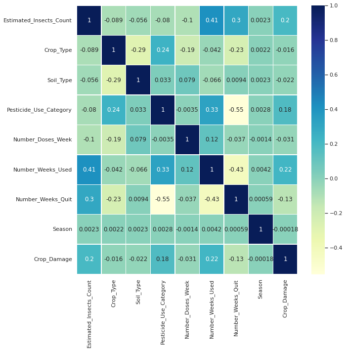
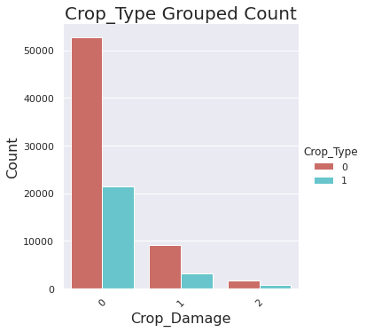
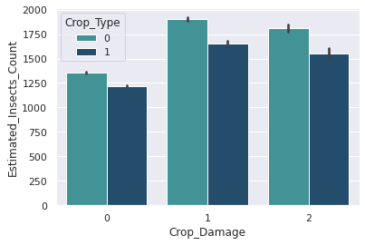
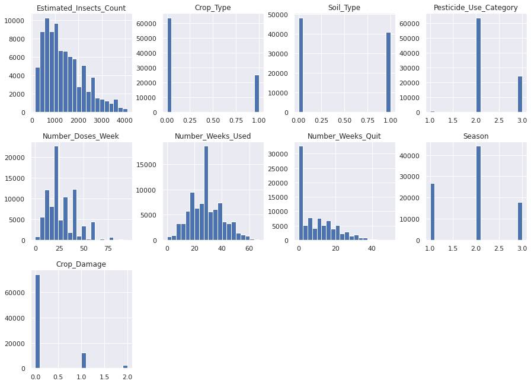
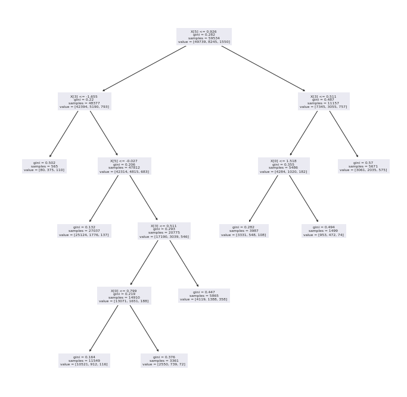

# Machine_Learning-Project 
Hello all,
</br>
Nice to see you exploring my machine learning project which I made during my 5th semester along with [Navaneeth](https://github.com/itsNavaneeth).
</br>
The project's main aim is to the **predict the health of crops** of various types given its exposure to various factors such as soil type, insect counts,season, pesticides etc
</br>
Training set consists of ***88858*** number of rows and **11** features
</br>
We use classification models in </br>
## Machine Learning such as: </br>
*Logistic Regression* </br>
*K-Nearest-Neighbors* </br>
*Random Forest Classifier*</br>
*Decision Tree Classifier* to classify our test instances into 3 various categories namely: <br>
## 1) No Damage</br>
## 2) Damage due to use of pesticides </br>
## 3) Damage due to other factors </br>
> After initial look up of the dataset we realised that there were missing values in one of the columns and hence we went about using fillna method to replace all the missing values
by their mean value</br>

**Correlation matrix**</br>
## Correlation Matrix
</br>
>From the correlation matrix we found out that there were a few irrelevant features in the dataset and few were highly positively correlated and hence
 would be useful in classification
</br>1.Estimated_Insects_count,Pesticide_use_category and Number_weeks_used are positively correlated with Crop damage.</br>
2.Number_weeks_used  is positively correlated with Estimated_Insects_count and Pesticide_use_category.</br>
## Univariate analysis
</br>
>1.Crop damage due to pesticides are less in comparison to damage due to other causes.</br>
2.Crop type 0 has higher chance of survival compared to crop type 1.</br>
## Bivariate Analysis
</br>
>1. Clearly observed that Most insect attacks are done on crop type 0. </br>
# Skew Analysis
</br>
>1. We can see that all the data is normally distributed.</br>
>
## 4 Models mentioned are built and thier accuracies are compared using graphs </br>
</br>
***Hyperparameters are not used yet for training these models*** </br>
>Model : Logistic Reg accuracy score : 0.8332764970672487 </br>
Model : Random Forest accuracy score : 0.8245123448369935 </br>
Model : KNN accuracy score : 0.8280248260810258 </br>
Model : Decision Tree Classifier accuracy score : 0.748806438412222 </br>
</br>

## Trying Hyperparameters while training 
</br>
*Decision Tree Classifier Performed best when max_depth was 10*
</br>

*KNN Performed almost as good as Logistic regression or decision tree classifier with max_depth=10 when n_neighbors was set to 23*
```
kmeans = KNeighborsClassifier(n_neighbors=23)
kmeans.fit(x_train,y_train)
y_pred = kmeans.predict(x_test)
print("accuracy score is : ",accuracy_score(y_test,y_pred))
cm = confusion_matrix(y_test,y_pred)
sns.heatmap(cm, annot=True, cmap = "Blues")
print("classification report \n",classification_report(y_test,y_pred))
```
```
accuracy score is :  0.841836038739599
classification report 
               precision    recall  f1-score   support

           0       0.86      0.98      0.92     24499
           1       0.50      0.17      0.26      4062
           2       0.06      0.00      0.00       763

    accuracy                           0.84     29324
   macro avg       0.47      0.38      0.39     29324
weighted avg       0.79      0.84      0.80     29324
```
### Ensemble learning with default hard-voting classifier model was used to train and thus classify records 

```
from sklearn.ensemble import VotingClassifier
from sklearn.tree import DecisionTreeClassifier
x_train,x_test,y_train,y_test = train_test_split(df_xc,yc,random_state = 42,test_size = 0.33,stratify = yc)

model1 = LogisticRegression()
model2 = DecisionTreeClassifier()
model3 = RandomForestClassifier()
model4 = KNeighborsClassifier(n_neighbors=10)

model = VotingClassifier(estimators=[('lr', model1), ('dt', model2),('rf', model3),('kn', model4)], voting='hard')

model.fit(x_train,y_train)
model.score(x_test,y_test)
```
### Conclusion
>Accuracy Score of the model : 0.8391078979675352 </br>
>This accuracy is almost as same as our models after hyperparameters were added and hence our overall classification is accuract 83.9% of the times </br>
